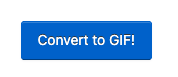
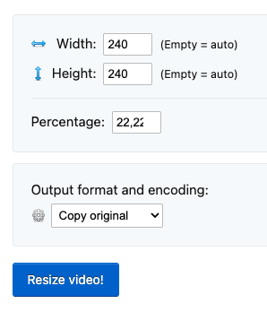
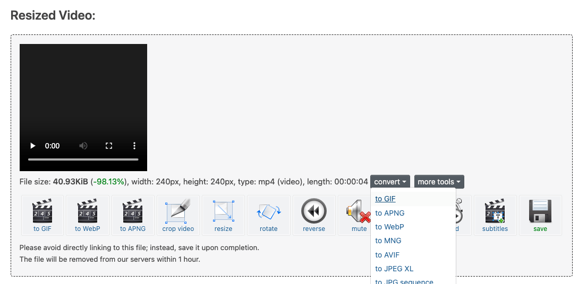
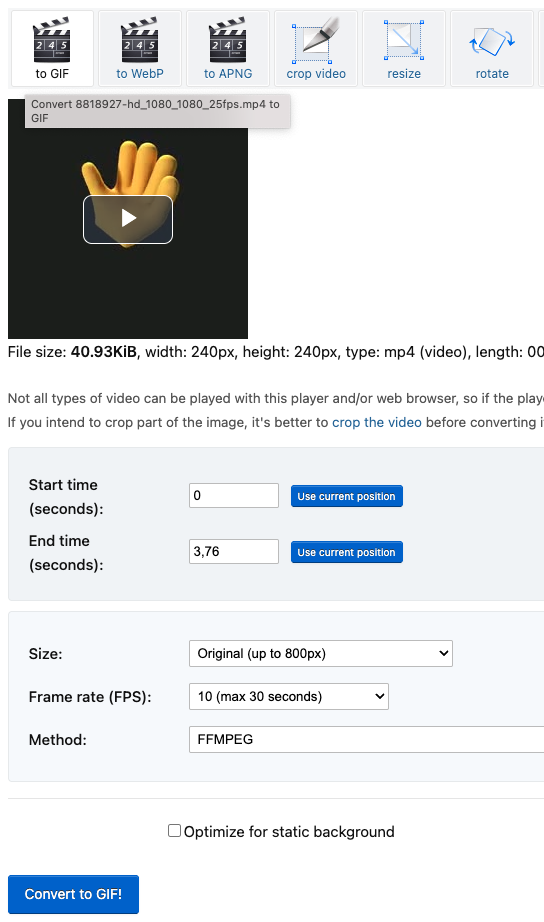
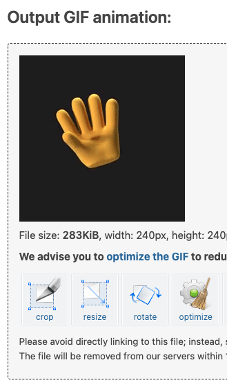
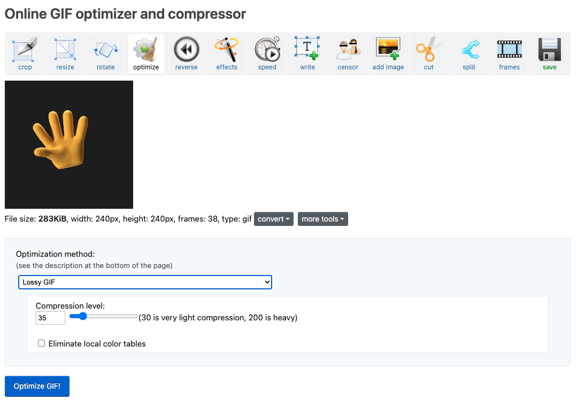

# GIF Compression Guide

A simple guide to keep GIF animations small, smooth, and good-looking when creating or customizing themes.

## Table of Contents

- [Why compress GIFs?](#why-compress-gifs)
- [Quick tips](#quick-tips)
- [How to compress with ezgif.com](#how-to-compress-with-ezgifcom)
  - [From video to GIF](#from-video-to-gif)
  - [Optimize an existing GIF](#optimize-an-existing-gif)
- [Suggested presets](#suggested-presets)
- [Checklist before using on PandaKnomi](#checklist-before-using-on-pandaknomi)
- [Uploading optimized GIFs to PandaKnomi](#uploading-optimized-gifs-to-pandaknomi)

## Why compress GIFs?

PandaKnomi uses GIFs to show animations and themes on the device screen. Because of hardware limitations:

- **Each individual GIF must be ≤ 1.5 MB (1536 KB, 1 MB = 1024 KB).**
- **The total size of all GIFs together must be ≤ 3 MB (3072 KB, 1 MB = 1024 KB).**
- **The screen resolution is 240 × 240 pixels.**

If GIFs are too large:

- They may not load correctly on the device.
- Animations can slow down or cause errors.
- Less space is available for other themes and files.

Keeping GIFs optimized ensures smooth performance, better visuals, and compatibility with PandaKnomi.

## Quick tips

1. **Keep it short.** Show only the essential animation.
2. **Resize.** Always set width and height to **240 px**.
3. **Lower frame rate.** 10–15 fps.
4. **Reduce colors.** 64–128 colors usually looks fine.
5. **Use lossy compression.** This shrinks file size while keeping good quality.
6. **Crop the area.** Focus only on what matters.

> Sometimes compression produces artifacts, always check playback on the device

## How to compress with ezgif.com

### From video to GIF

1. **Upload video**

   - Open **https://ezgif.com/video-to-gif**
   - **Upload** your video file or paste a URL
   - **Trim** the start and end points to keep only the essential animation
   - Click **Convert to GIF!**

     

2. **Resize to 240×240**

   - Click **resize** on the result page

     

   - Set dimensions to **240 × 240 pixels**
   - Click **Resize Video!**

     

3. **Convert with settings**

   - Open the **convert** dropdown and select **to GIF**

     

   - Set start/stop times, frame rate (10-15 fps recommended)
   - Click **Convert to GIF!**

     

4. **Optimize compression**

   - Click the **optimize** button on the resulting GIF

     

   - Adjust compression settings (colors: 64-128, lossy: 20-60)
   - Click **Optimize GIF**

     

5. **Download**

   - Click **Save** to download your optimized GIF

     

### Optimize an existing GIF

1. Open **https://ezgif.com/optimize**
2. Upload your existing GIF
3. Use the resize tool if needed to get 240×240 dimensions.
4. Adjust settings (colors, lossy compression)
5. Click **Optimize GIF**
6. Download the result

## Suggested presets

**Preset 1 – Slow changes**

- FPS: **12–15**
- Colors: **128**
- Lossy: **25–35**
- Target size: **≤ 1.5 MB**

**Preset 2 – Motion**

- FPS: **15**
- Colors: **64**
- Lossy: **30–80**
- Target size: **≤ 1.5 MB**

> Remember: **All GIFs combined must not exceed 3 MB total.**

## Checklist before using on PandaKnomi

- [ ] Trimmed to only the needed animation
- [ ] Size = 240 × 240 px
- [ ] FPS 10–15
- [ ] Colors 64–128
- [ ] Lossy 20–60
- [ ] Each GIF ≤ 1.5 MB (1536 KB)
- [ ] Total of all GIFs ≤ 3 MB (3072 KB)
- [ ] **Tested with the Knomi preview option** (sometimes compression produces artifacts, so always check playback on the device)

## Uploading optimized GIFs to PandaKnomi

After you've optimized your GIFs, add them to PandaKnomi so the theme can use them. The official reference is on the BTT Panda Knomi wiki: https://bttwiki.com/PandaKnomi.html#theme-settings-and-img-sharing.
